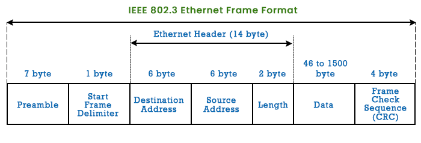

# Packet Sniffer

This project is a basic packet sniffer written in Python. It captures and displays Ethernet, IPv4, ICMP, TCP, and UDP packet information in a readable format.
**This project is built for Linux.** 

## Overview

A packet sniffer is a tool that captures and analyzes network packets.  
This packet sniffer captures raw packets at the data link layer, processes them, and then displays the details of each packet, including Ethernet frames, IPv4 packets, and ICMP, TCP, and UDP segments.

## Note

**This project is built for Linux.**<br>
It utilizes raw sockets which require administrative privileges and are typically supported on Unix-like operating systems such as Linux.

## Features

- Capture and parse Ethernet frames
- Decode and display IPv4 packets
- Handle and display ICMP packets
- Process and display TCP segments
- Unpack and show UDP segments
- Format and present packet data in a human-readable form

## Usage

### Imports

The script uses the following imports:
- `socket`: Provides access to the BSD socket interface.
- `struct`: Provides functions to work with C-style data structures.
- `textwrap`: Used to format multi-line data output.

### Functions

- `ethernetFrame(data)`: Unpacks Ethernet frames.
- `getMacAddr(rawMacAddr)`: Converts raw MAC addresses to a readable format.
- `ipv4_packet(data)`: Unpacks IPv4 packets.
- `ipv4(addr)`: Converts a binary IP address to a dotted-decimal format.
- `icmp_packet(data)`: Unpacks ICMP packets.
- `tcp_segment(data)`: Unpacks TCP segments.
- `udp_segment(data)`: Unpacks UDP segments.
- `format_multi_line(prefix, string, size=80)`: Formats multi-line data output.

### Main Function

The `main` function sets up a raw socket and enters an infinite loop to continuously capture and process network packets.

### How to Run

To run the packet sniffer, execute the script directly with admin privileges:

```bash
sudo python3 packetSniffer.py
```

<br>

# Detailed Explanation

## Ethernet Frame



The `ethernetFrame` function unpacks the first 14 bytes of the Ethernet frame, which includes the destination MAC, source MAC, and Ethernet protocol.

### ethernetFrame() 

- `struct.unpack('! 6s 6s H', data[:14])`: This line unpacks the first 14 bytes of the Ethernet frame.
- `! 6s 6s H`: The format string specifies how to unpack the data:
  - `!`: Network (big-endian) byte order.
  - `6s`: A string of 6 bytes (used for the MAC addresses).
  - `H`: An unsigned short (2 bytes, used for the Ethernet type field).
- `data[:14]`: The first 14 bytes of the Ethernet frame contain:
  - `destinationMAC`: The destination MAC address (6 bytes).
  - `sourceMAC`: The source MAC address (6 bytes).
  - `ethernetProtocol`: The Ethernet type field (2 bytes).

### getMacAddr()

- `getMacAddr(destinationMAC)`: Converts the destination MAC address to a human-readable format.
- `getMacAddr(sourceMAC)`: Converts the source MAC address to a human-readable format.
- `socket.htons(ethernetProtocol)`: Converts the Ethernet type from network byte order to host byte order.
- `data[14:]`: Returns the remaining part of the Ethernet frame, which contains the actual data payload.

This function converts a raw MAC address (a sequence of bytes) into a human-readable, formatted MAC address string.

- `'{:02x}'.format`: This is a format string that converts a byte to a two-character hexadecimal string.
- `{:02x}`: 
  - `02`: Ensures the hexadecimal number is at least 2 digits, padding with a zero if necessary.
  - `x`: Specifies that the number should be formatted in hexadecimal.

For example, if the input is a sequence of bytes: `b'\x00\x1a\x2b\x3c\x4d\x5e'`:

Formatting Each Byte:

The `map` function applies the format `'{:02x}'.format` to each byte in the sequence. Let's break this down for each byte:
- `\x00` → '00'
- `\x1a` → '1a'
- `\x2b` → '2b'
- `\x3c` → '3c'
- `\x4d` → '4d'
- `\x5e` → '5e'

After applying the formatting, the result is an iterable of strings: `['00', '1a', '2b', '3c', '4d', '5e']`.

Joining the Hexadecimal Strings:

`:'.join(bytes_str)`: The `join` method concatenates these strings with a colon (:) as the separator:
`['00', '1a', '2b', '3c', '4d', '5e']` becomes `00:1a:2b:3c:4d:5e`.

Converting to Uppercase:

`.upper()`: The `upper` method converts the entire string to uppercase:
`00:1a:2b:3c:4d:5e` becomes `00:1A:2B:3C:4D:5E`.

<br>

## IPv4 Header


This function unpacks an IPv4 packet, extracting key information such as the version, header length, time-to-live (TTL), protocol, source, and destination IP addresses.

### ipv4_packet()

- `data[0]`: The `version_header_length` variable (which is `data[0]`) is the entire first byte of the IPv4 header, and this byte contains both the version and the header length.
- `version` = `version_header_length >> 4` - Removes the header length after 4 bits from the `data[0]`.
- `header_length` = `(version_header_length & 15) * 4`
  - A 4-bit binary number can have a maximum value of `1111` in binary, which is equal to 15 in decimal.
  - Each 32-bit word is 4 bytes, so to get the header length in bytes, we multiply the result by 4.
- `struct.unpack('! 8x B B 2x 4s 4s', data[:20])`: This line unpacks specific fields from the first 20 bytes of the IPv4 packet.
- `'! 8x B B 2x 4s 4s'`: The format string specifies how to unpack the data:
  - `'!'`: Network (big-endian) byte order.
  - `'8x'`: Skip the first 8 bytes (64 bits) (version, header length, type of service, total length, identification, flags and Fragment Offset).
  - `'B'`: Extract the TTL (1 byte).
  - `'B'`: Extract the protocol (1 byte).
  - `'2x'`: Skip the next 2 bytes (header checksum).
  - `'4s'`: Extract the source IP address (4 bytes).
  - `'4s'`: Extract the destination IP address (4 bytes).

<br>

## ICMP Packet


### icmp_packet()

The `icmp_packet` function unpacks the ICMP packet, extracting the type, code, and checksum.

- `icmp_type, code, checksum = struct.unpack('! B B H', data[:4])`
  - `!`: Network (big-endian) byte order.
  - `B`: Unsigned char (1 byte) for the ICMP type.
  - `B`: Unsigned char (1 byte) for the ICMP code.
  - `H`: Unsigned short (2 bytes) for the checksum.
- `data[4:]`: The remaining part of the packet after the first 4 bytes.

<br>

## TCP Segment


### tcp_segment()

The `tcp_segment` function unpacks the TCP segment, extracting the source port, destination port, sequence number, acknowledgment number, and flags.

- `srcPort, destPort, seqNum, ackNum, offset_reserved_flags = struct.unpack('! H H L L H', data[:14])`
  - `!`: Network byte order (big-endian).
  - `H`: Unsigned short (2 bytes) for source and destination ports.
  - `L`: Unsigned long (4 bytes) for sequence and acknowledgment numbers.
  - `H`: Unsigned short (2 bytes) for offset, reserved, and flags.
- `offset = (offset_reserved_flags >> 12) * 4`: Calculates the data offset, converting the size from 32-bit words to bytes.
- `data[offset:]`: The remaining part of the TCP segment after the offset.

<br>

## UDP Segment


### udp_segment()

The `udp_segment` function unpacks the UDP segment, extracting the source port, destination port, length, and checksum.

- `src_port, dest_port, udp_length = struct.unpack('! H H H', data[:6])`
  - `!`: Network byte order (big-endian).
  - `H`: Unsigned short (2 bytes) for the source and destination ports and length.
- `data[6:]`: The remaining part of the UDP segment after the first 6 bytes.

<br>

## Socket Setup

The socket is set up with the following parameters:

- `socket.AF_PACKET`: For low-level packet interface.
- `socket.SOCK_RAW`: Provides raw network protocol access.
- `socket.ntohs(3)`: Captures all Ethernet frames.

This line of code creates a socket that:
- Captures Packets at Layer 2: The socket operates at the data link layer, allowing it to capture Ethernet frames directly from the network interface.
- Provides Raw Access: The raw socket type means that the socket will receive the entire packet, including the Ethernet header and any higher-layer protocol data.
- Captures All Protocols: Using socket.ntohs(3), the socket is set up to capture all types of Ethernet frames, not filtering by a specific higher-layer protocol.

<br>

## Infinite Loop

The infinite loop continuously captures and processes packets, displaying their details.

- `conn.recvfrom(65536)` waits for incoming packets and receives them from the network interface.
  The argument 65536 specifies the maximum amount of data to be received at once, which is 65,536 bytes (enough to capture the largest possible Ethernet frame).
  This function returns two values:
  - raw_data: The raw packet data.
  - addr: The address of the sender (not used in this particular context).

<br>

### Packet Processing


When `ethernetProtocol == 8`, the code processes IPv4 packets. It extracts the version, header length, TTL, protocol, source IP, and destination IP. Based on the protocol value, it further processes:

- **ICMP (proto == 1)**: Extracts and displays type, code, and checksum.
- **TCP (proto == 6)**: Extracts and displays source/destination ports, sequence/acknowledgment numbers, and flags.
- **UDP (proto == 17)**: Extracts and displays source/destination ports and length.

<br>

## Formatting
The format_multi_line function is used to format the packet data into a readable multi-line string.

<br>

## Entry Point
`__name__ == "__main__"`  
is a common Python idiom used to ensure that a certain block of code only runs when the script is executed directly, and not when it is imported as a module in another script.

<br>

## Conclusion
This packet sniffer is a basic yet powerful tool for capturing and analyzing network packets. It demonstrates how to use raw sockets and the struct module to parse and display various network protocols.

<br>

## License
This project is licensed under the MIT License.
